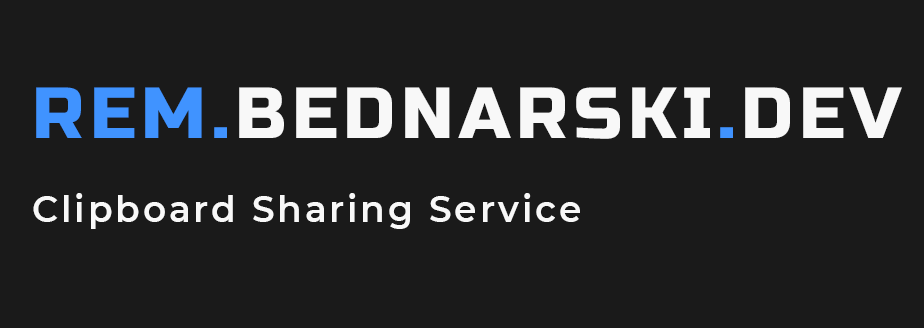

   

---

Source of **Rem**, simple clipboard sharing web application build with **Flask** and **Vue.js** used to share snippets of code between my colleagues during university laboratories.

> 🔥 It's up! Check it out live at [rem.bednarski.dev](https://rem.bednarski.dev/)!

 

## ⁉ Why build another Pastebin service?

Aside from learning experience, Using **Rem** has some advantages over other methods of sharing text:

- **Number Only Codes**

  Because of the temporality of shares only numbers are used for identifying them, which means It's easier to share them with people sitting next to you.

- **No Login Required**

  I build Rem because I didn't want to log to Facebook on somebody's else computer to share stuff between my friends.

 

## 🛠 Technology Stack

Rem was build using my trusted web app stack, with additional tools to spice things up.

### Backend

The servers side of Rem consists of the **Redis** database with a simple dockerized **Flask** app.  
 **PyTest** with **Docker Compose** is used for basic functional testing on the GitHub Actions platform.

Metrics are gathered using self-hosted **TIG** stack and exceptions monitoring is handled by managed **Sentry** instance.

### Frontend

As for the client-side, **Vue.js** with **Axios** is used for the logic of the **CSS Grid** heavy interface.  
 **Sentry** is also used for monitoring exceptions.

> 🔌 Rem is currently deployed on (Arm/Amd64) **Docker Swarm** cluster.

 

## 🚧 Contributing

**You are more than welcome to help me improve Rem!**

Just fork this project from the `master` branch and submit a Pull Request (PR) to the `dev` branch.
If you are modifying backend you should also run `pytest` functional tests inside `backend/tests` directory.

 

## 📃 License

This project is licensed under [GPL-3.0](https://choosealicense.com/licenses/gpl-3.0/) .
